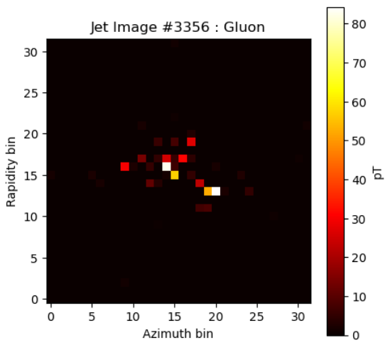
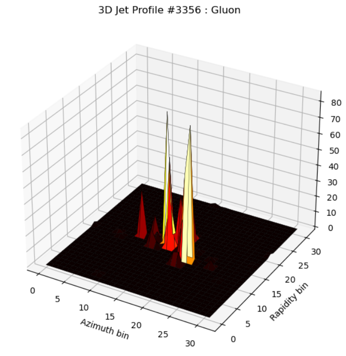
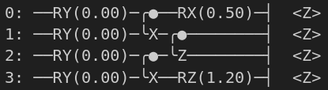

# Quanvolution for Quark/Gluon Jet Tagging

During my BSc thesis, I worked on **quantum convolution**, a fancy name for applying a k×k-qubit quantum circuit to an image via a sliding window as a convolution kernel. The goal is to reduce the complexity of the image while capturing its essential features. The original work I did was on medical imaging, but I thought, “Hey, why not apply it to HEP? I mean, a matrix is a matrix…,” and that’s what I’ve done.

The first problem was how to go from having a cloud of points to having a matrix of values (also called an image) without losing too much information about the jets. Initially, I tried selecting the min and max values of η and φ (my x and y axes) dynamically for each jet, splitting that rectangle into 32×32 bins, and simply counting how many particles fell into each bin to define pixel intensity. **Spoiler**: it didn’t work too well.

The second (and, luckily, final) implementation is not far from the first one. The only change is that each pixel’s intensity is given by the total transverse momentum pT of the particles that fall into that bin. Here are the 2D and 3D representations of a jet:  

On these 2D images, I applied **quanvolution**, where each 2×2 patch is processed by the following small quantum circuit with random parameters:  

Below is a concise three-step description of the **quanvolution** process as shown in your `quanvolve(image)` function:
1. **Flatten & Normalize a 2×2 Patch**  
   Each 2×2 patch of the image is extracted and reshaped into a 4-element array (one pixel per qubit). The patch is then normalized by its maximum value (if nonzero) to keep inputs in a consistent range.
2. **Run the Quantum Circuit**  
   This 4-element array is fed into the quantum circuit, which encodes each value into qubit rotations and applies a short series of gates (entangling operations, measurements, etc.). The circuit returns four measured expectation values (one per qubit).
3. **Aggregate Measurements**  
   The four output values from the quantum circuit are averaged to produce a single number for the 2×2 patch, thus forming the new “quanvolved” pixel in the output image.

After the quantum layer, the image is fed into a simple CNN model to produce a final prediction of the jet’s nature.

The idea behind all of this, and what fascinates me the most, is that, by using quantum states to represent pixels, we may generate interactions and new states not replicable by classical computation, and thus possibly extract unique features with such kernels.

**Conclusion:**  
The quantum component was implemented using Pennylane, it's the library I know and like the most.

The performance of the model is not fantastic but I will give it at least a **promising** grade since I used only 100k jets, a pretty simple quantum circuit and my poor pc to do the computation.
